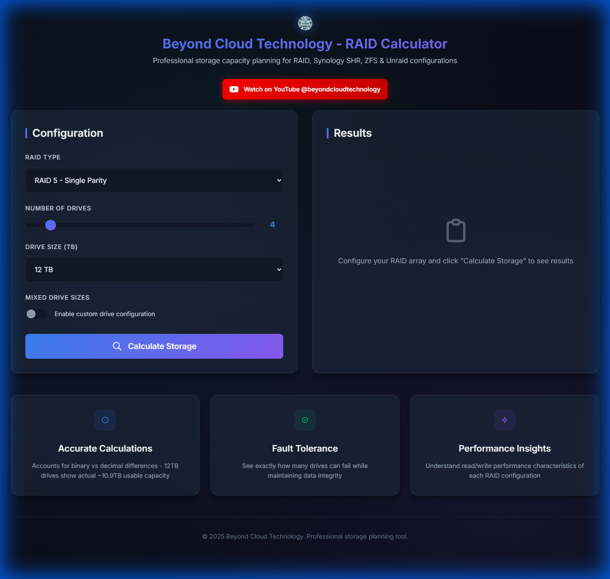
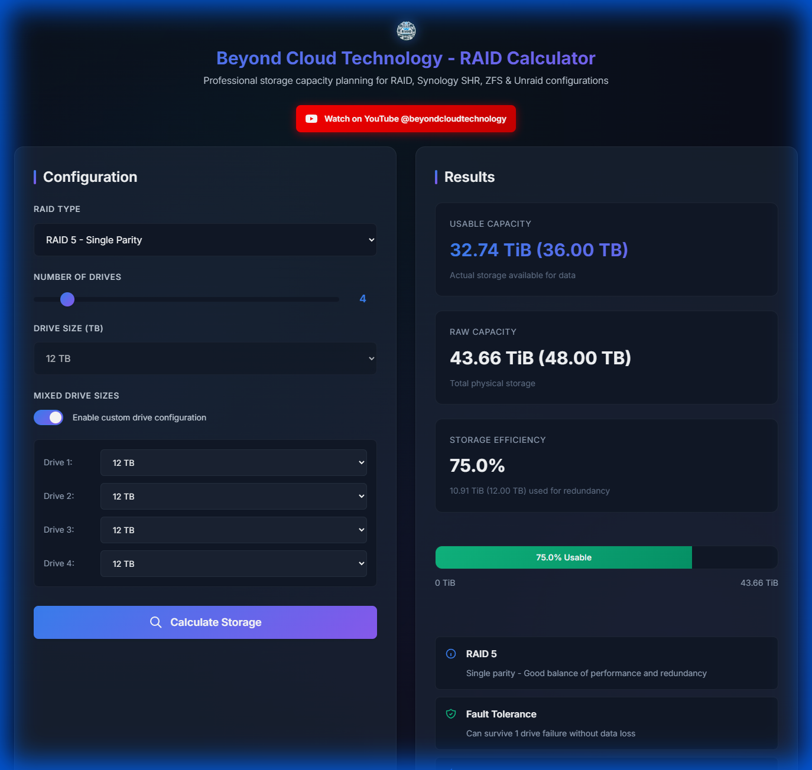
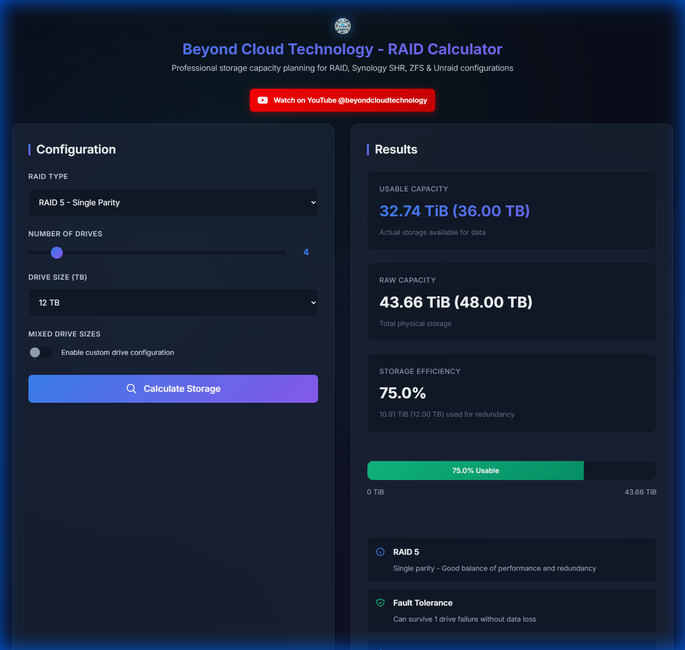

# Advanced RAID Calculator

A professional storage capacity planning tool for various RAID configurations, including standard RAID, Synology SHR, ZFS, and Unraid. Built by [Beyond Cloud Technology](https://www.youtube.com/@beyondcloudtechnology).

## 🌟 Features

- **Wide RAID Support** - Calculates usable storage for:
  - Standard RAID: 0, 1, 5, 6, 10
  - Synology: SHR & SHR-2
  - ZFS: Stripe, Mirror, RAIDZ1, RAIDZ2, RAIDZ3
  - Unraid: 1 or 2 parity drives

- **Accurate Calculations** - Accounts for the difference between decimal (TB) and binary (TiB) units, showing you the actual usable capacity (e.g., 12TB drives = 10.91 TiB actual)

- **Mixed Drive Sizes** - Supports configurations with drives of different sizes, especially useful for SHR, ZFS, and Unraid

- **ZFS vdev Support** - Configure multiple vdevs within ZFS pools for advanced configurations

- **Clear Results** - Displays:
  - Usable capacity (in both TiB and TB)
  - Raw capacity
  - Storage efficiency percentage
  - Fault tolerance (how many drives can fail)
  - Read/write performance insights

- **Intuitive Interface** - Easy-to-use sliders and dropdowns with real-time validation

## 📖 How to Use

### 1. Open the Calculator

Simply open the `index.html` file in any modern web browser. No installation or server required!

### 2. Select Your RAID Type

Choose your desired RAID configuration from the dropdown menu. Options are organized by category:

- **Standard RAID** - Traditional RAID levels (0, 1, 5, 6, 10)
- **Synology RAID** - SHR and SHR-2 for Synology NAS devices
- **ZFS RAID** - ZFS configurations including RAIDZ variants
- **Unraid** - Unraid parity configurations

### 3. Configure Your Drives

#### Option A: Uniform Drive Sizes

For arrays with identical drives:
1. Use the **Number of Drives** slider to set how many drives you have (2-24)
2. Select the **Drive Size (TB)** from the dropdown (1TB to 24TB)

#### Option B: Mixed Drive Sizes

For arrays with different sized drives (perfect for SHR, Unraid, or ZFS):

1. Toggle the **Mixed Drive Sizes** switch to enable custom configuration
2. Individual drive size selectors will appear for each drive
3. Set the size for each drive independently

#### Option C: ZFS with Multiple vdevs

For advanced ZFS configurations:
1. Select a ZFS RAID type (Mirror, RAIDZ1, RAIDZ2, or RAIDZ3)
2. Configure the **Number of vdevs** slider
3. Set **Drives per vdev** to determine how many drives in each vdev
4. The total drive count is calculated automatically

### 4. Calculate Storage

Click the **Calculate Storage** button to perform the calculation.

### 5. Review Results

The results panel will display comprehensive information about your configuration:

**Results include:**
- **Usable Capacity** - The actual storage available for your data (shown in both TiB and TB)
- **Raw Capacity** - Total capacity of all drives combined
- **Storage Efficiency** - Percentage of raw capacity that's usable
- **Fault Tolerance** - How many drives can fail simultaneously without data loss
- **Performance Insights** - Read and write performance characteristics
- **Drive Configuration** - Summary of your drive setup

## 💡 Understanding the Results

### Capacity Units

The calculator shows capacity in both formats:
- **TiB (Tebibytes)** - Binary units (1024-based), what your OS reports
- **TB (Terabytes)** - Decimal units (1000-based), how drives are marketed

**Example:** A 12TB drive shows as approximately 10.91 TiB in your operating system.

### Storage Efficiency

This shows what percentage of your total drive capacity is actually usable:
- **RAID 0** - 100% (no redundancy)
- **RAID 1** - 50% (full mirroring)
- **RAID 5** - Varies based on drive count: (n-1)/n
- **RAID 6** - Varies based on drive count: (n-2)/n
- **SHR/Unraid** - Optimized based on drive sizes

### Fault Tolerance

Indicates how many drives can fail before data loss:
- **0 drives** - No redundancy (RAID 0, ZFS Stripe)
- **1 drive** - Single parity (RAID 5, RAIDZ1, SHR, Unraid-1)
- **2 drives** - Double parity (RAID 6, RAIDZ2, SHR-2, Unraid-2)
- **3 drives** - Triple parity (RAIDZ3)

## 🔧 Technical Details

### Technology Stack
- **Frontend:** HTML5, CSS3, JavaScript (ES6+)
- **Fonts:** Inter (Google Fonts)
- **No Dependencies:** Pure vanilla JavaScript, no frameworks required
- **Client-Side:** All calculations performed in the browser

### Calculation Methodology

The calculator uses industry-standard formulas for each RAID type:

- **Standard RAID** - Traditional RAID calculations accounting for parity and mirroring
- **Synology SHR** - Simulates Synology's hybrid RAID algorithm for optimal space utilization
- **ZFS** - Accounts for vdev striping and RAIDZ parity overhead
- **Unraid** - Calculates based on largest drive(s) being used for parity

All calculations account for the binary/decimal conversion (TB to TiB).

## 🌐 Browser Support

Works on all modern browsers:
- ✅ Chrome/Edge (Chromium-based)
- ✅ Firefox
- ✅ Safari
- ✅ Opera

## 📱 Responsive Design

The calculator is fully responsive and works on:
- Desktop computers
- Tablets
- Mobile phones

## 🎯 Use Cases

Perfect for:
- **Home Lab Enthusiasts** - Planning NAS storage upgrades
- **IT Professionals** - Calculating storage requirements for clients
- **Data Hoarders** - Optimizing storage efficiency
- **System Administrators** - Comparing different RAID configurations
- **Students** - Learning about RAID technology and storage efficiency

## 🚀 Getting Started

1. Download or clone this repository
2. Open `index.html` in your web browser
3. Start calculating!

No build process, no dependencies, no installation required.

## 📄 License

This project is licensed under the GNU General Public License v3.0 - see the [LICENSE](LICENSE) file for details.

## 🎥 Learn More

Visit our YouTube channel [@beyondcloudtechnology](https://www.youtube.com/@beyondcloudtechnology) for tutorials, guides, and tech content.

## 👨‍💻 About Beyond Cloud Technology

Professional technology solutions and educational content for IT professionals and enthusiasts.

---

**© 2025 Beyond Cloud Technology. Professional storage planning tool.**
